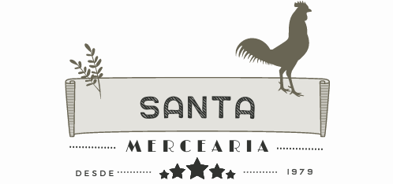

# Controle de Estoque
Projeto integrador realizado na UNISC em Santa Cruz do Sul.

Sistema para cadastro de itens utilizando Excel como banco de dados local facilitando a pandas em pequenos mercados.

Como estava usando esse projeto para aprendizado, fiz uso dos seguintes framework e ferramentas para a construção da GUI e funcionalidades: 
* Tkinter
* PySimpleGUI
* Openpyxl
* Penpyxl
* Pandas

## Pré-requisito

Vocẽ precisa ter Python instalado na sua maquina:

* Abra seu terminal:
  ```sh
  sudo apt install python3
  ```
* Verifique se a instalação foi feita com sucesso:
  ```sh
  python3 --version
  ```
  
<details>
    <summary>Windows</summary>
      1. Baixe o instalador do Python 3 no site oficial do Python (https://www.python.org/downloads/). Certifique-se de baixar a versão apropriada para o seu sistema operacional (Windows).
      <br>
      2. Navegue até a pasta onde você baixou o instalador do Python normalmente estara na sua pasta Downloads e execute o arquivo .exe.
        <br>
      3. Siga as instruções na tela para concluir a instalação. Certifique-se de selecionar a opção "Add Python 3.X to PATH" durante a instalação, para que o Python seja adicionado ao PATH do sistema.
        <br>
      4. Abra seu terminal e verifique se foi instalado corretamente digitando o comando "python" no seu Bash ou PowerShell.
</details>
  


## Instalação dos Frameworks/Bibliotecas
* Abra seu terminal na pasta do arquivos do programa:
   ```sh
   pip install tkinter
   pip install PySimpleGUI
   pip install Openpyxl
   pip install Penpyxl
   pip install Pandas
   ```
   
 ## Imagens do Programa
 

 


